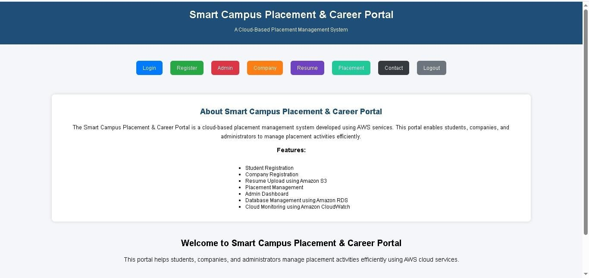
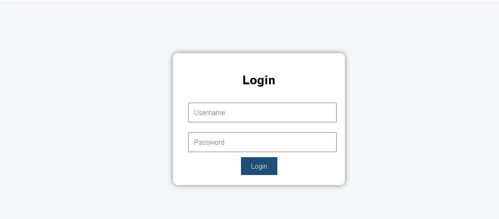
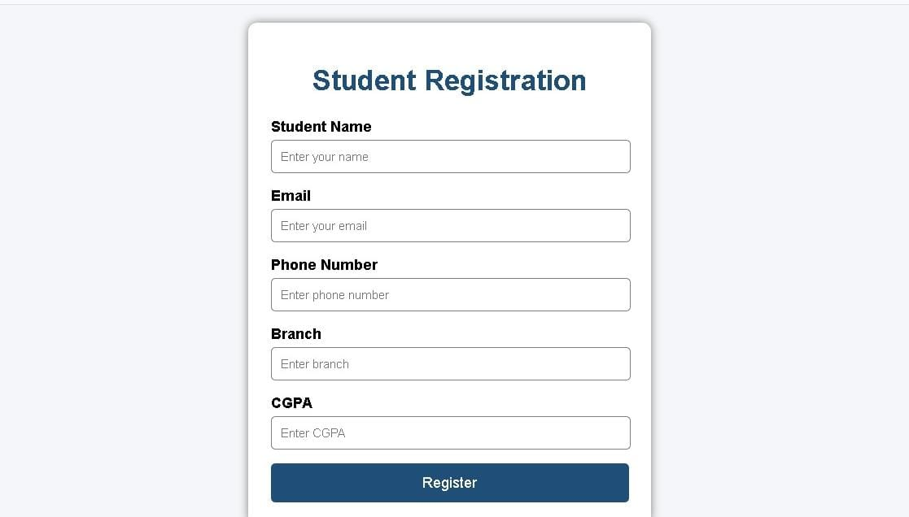
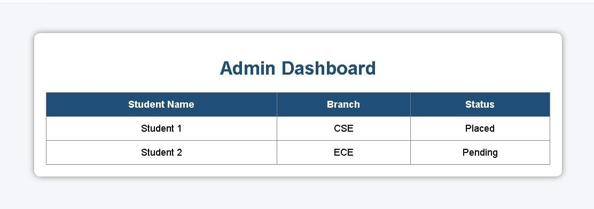
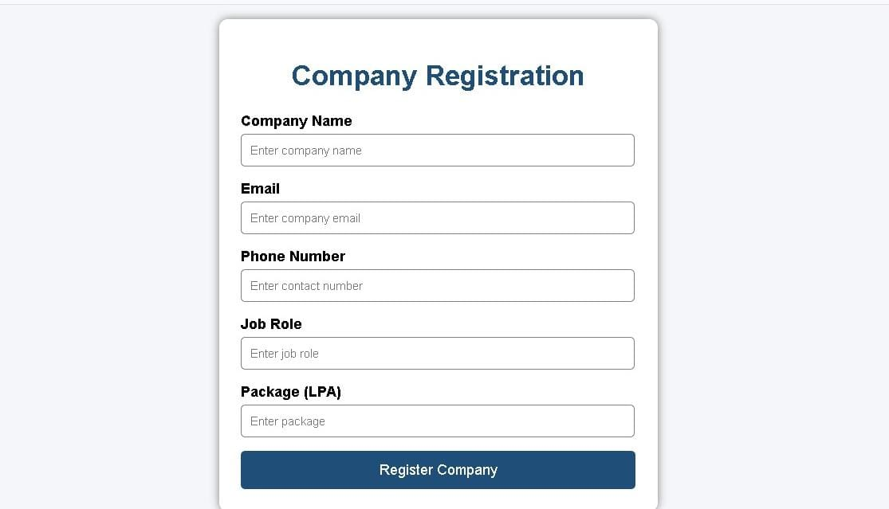
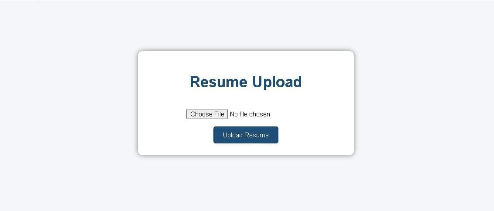
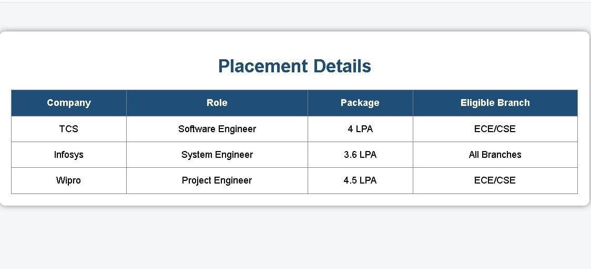
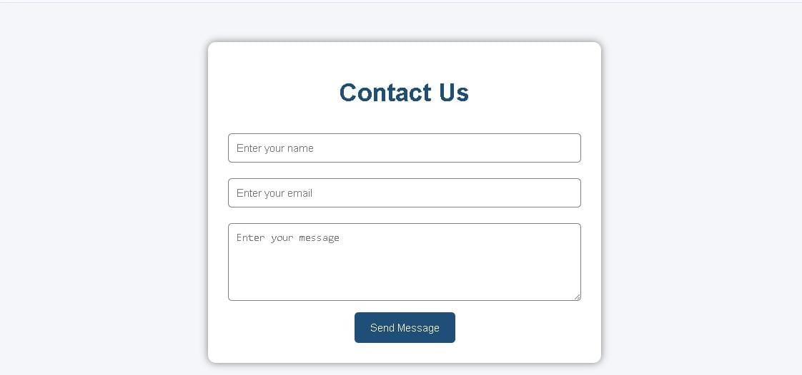

# 🎓Smart Campus Placement Portal

A cloud-based web application designed to simplify and digitalize the campus placement process by connecting students, administrators, and companies on a single platform.

---

## 📌 Project Overview

The Smart Campus Placement Portal is a web-based application developed to manage and streamline campus placement activities.

The system provides a centralized platform where:

- 👨‍🎓 Students can register and access placement-related information.
- 🏢 Companies can view placement-related details.
- 👨‍💼 Administrators can manage placement activities.
- 📄 Students can manage resume-related information.
- 📢 Users can access placement updates and contact information.

The application is deployed on Amazon Web Services (AWS) using cloud infrastructure.

---

## 🎯 Objectives

- To digitize the campus placement process.
- To provide a centralized placement management platform.
- To reduce manual paperwork and effort.
- To improve communication between students, companies, and administrators.
- To provide easy access to placement-related information.
- To deploy the application using cloud computing services.

---

## ✨ Key Features

### 👨‍🎓 Student Module

- Student Registration
- Student Login
- Resume Management
- Placement Information
- Access to company details

### 🏢 Company Module

- Company Information
- Placement-related details
- Access to student placement information

### 👨‍💼 Admin Module

- Manage placement activities
- Manage student information
- Manage company information
- Manage placement-related details

### 📄 Resume Module

- Resume-related information
- Student profile details
- Resume management

### 📞 Contact Module

- Contact information
- Communication support

---

## 🏗️ System Architecture

                👨‍🎓 Students
                     │
                     ▼
          ┌─────────────────────┐
          │  Smart Campus       │
          │  Placement Portal   │
          └─────────────────────┘
                     │
          ┌──────────┴──────────┐
          ▼                     ▼
      🏢 Companies          👨‍💼 Admin
                     │
                     ▼
              ☁️ AWS Cloud
                     │
          ┌──────────┴──────────┐
          ▼                     ▼
      Amazon EC2            Amazon RDS
      (Application)         (MySQL DB)

---

## 🛠️ Technologies Used

### Frontend

- HTML5
- CSS3

### Backend

- Python
- Flask

### Database

- MySQL
- Amazon RDS

### Cloud Platform

- Amazon Web Services (AWS)

### AWS Services Used

- Amazon EC2
- Amazon RDS
- Amazon VPC
- IAM
- Security Groups
- Amazon S3
- Amazon CloudWatch

### Development Tools

- Visual Studio Code
- Git
- GitHub

---

## 📁 Project Structure

Smart-Campus-Placement-Portal/
│
├── app.py
│
├── templates/
│   ├── index.html
│   ├── login.html
│   ├── register.html
│   ├── admin.html
│   ├── company.html
│   ├── resume.html
│   ├── placement.html
│   └── contact.html
│
├── static/
│   └── style.css
│
├── images/
│   ├── home-page.png
│   ├── login-page.png
│   ├── register-page.png
│   ├── admin-page.png
│   ├── company-page.png
│   ├── resume-page.png
│   ├── placement-page.png
│   └── contact-page.png
│
├── requirements.txt
│
└── README.md
---

## ☁️ AWS Deployment

The application is deployed on an Amazon EC2 instance.

Deployment Flow

User
 │
 ▼
Public IP Address
 │
 ▼
Amazon EC2
 │
 ▼
Flask Application
 │
 ▼
Amazon RDS (MySQL Database)

The application can be accessed through the EC2 public IP address after deployment.

---

## 🗄️ Database

The project uses MySQL as the database.

### The database is hosted on:

Amazon RDS

Amazon RDS provides a managed database environment for storing application data securely and reliably.

### The database can be used to store:

- Student details
- User login information
- Company information
- Placement details
- Resume information

---

## 🔐 Security

### The project uses AWS security features such as:

- IAM users and permissions
- Security Groups
- VPC networking
- Controlled access to AWS resources

Sensitive information such as passwords, access keys, and private credentials should not be stored in the source code or uploaded to GitHub.

---

## 🚀 Future Enhancements

### The project can be enhanced in the future with:

- Secure user authentication
- Student dashboard
- Company dashboard
- Admin dashboard
- Resume upload functionality
- Job application tracking
- Email notifications
- Advanced search and filtering
- Database integration
- HTTPS using SSL certificates
- Custom domain name
- Improved cloud security

---

## 📸 Project Screenshots

---

## 📸 Project Screenshots

### 🏠 Home Page

### 🔐 Login Page

### 📝 Student Registration Page

### 👨‍💼 Admin Dashboard

### 🏢 Company Page

### 📄 Resume Page

### 📊 Placement Page

### 📞 Contact Page

---

## 📚 Learning Outcomes

### Through this project, we gained knowledge in:

- Web application development
- HTML and CSS
- Python Flask backend development
- Database management using MySQL
- AWS EC2 deployment
- Amazon RDS
- IAM user management
- VPC and Security Groups
- Cloud-based application deployment
- Git and GitHub

---

## 👥 Project Team

This project was developed as an academic project to explore web development, backend technologies, database management, and cloud computing.

---

## 📄 License

This project is developed for educational and academic purposes.
